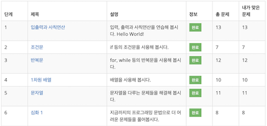

# 코딩 테스트 준비

## 백준 단계별 문제 풀이(완)

[[백준 링크](https://www.acmicpc.net/step)]
- - -
[문제 풀이 코드]
 - [입출력과 사칙연산 (13문제)](Baekjoon/coding_basic/iostream_and_arithmetic)
 - [조건문 (7문제)](Baekjoon/coding_basic/conditional_statement)
 - [반복문 (12문제)](Baekjoon/coding_basic/loop_statement)
 - [1차원 배열 (10문제)](Baekjoon/coding_basic/one_dimensional_array)
   - 기본 내장 배열(포인터)과 Vector 컨테이너 두 가지를 사용하여 구현
 - [문자열 (11문제)](Baekjoon/coding_basic/string)
 - [심화 1(8문제)](Baekjoon/coding_basic/deepening_1)
- - -
## 공부 내용 정리(노션)  
[백준 단계별 문제 내용 정리](https://eliotjang.notion.site/d1b78c20eb764b689969086c4eb30122?pvs=4)
